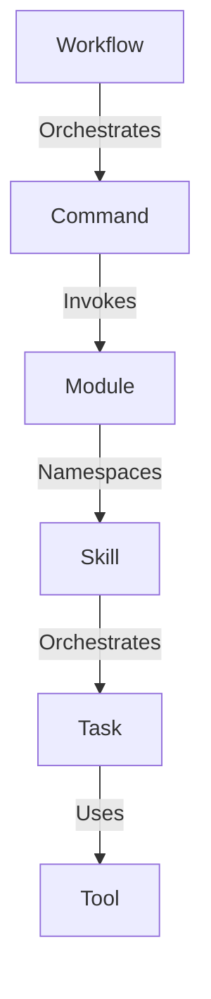

# System Concepts

This document defines the core concepts, runtime entities, and vocabulary used throughout CommandOS. Adhering to these definitions maintains clean boundaries across all layers.

---

## 1. Concepts Relationship Overview

---

## 2. Terminology Definitions

### 1. Tool (Infrastructure Layer)
* **Definition:** An atomic, low-level wrapper around a system capability or external service.
* **Characteristics:** Completely stateless, has zero business logic, and does not understand workflows or rules.
* **Examples:** `PlaywrightBrowserTool` (starts browser), `FileSystemTool` (reads/writes local files), `HttpClientTool` (performs API requests), `LLMClientTool` (issues prompt to model).

### 2. Task (Domain Layer)
* **Definition:** The smallest executable domain unit that resolves a single business task.
* **Characteristics:** Combines one or more Tools, validates input data, handles errors internally, and returns a clean structured result.
* **Examples:** `PDFParserTask` (reads raw file via FileSystemTool and extracts text), `LinkedInSyncTask` (uses PlaywrightBrowserTool to retrieve raw profile HTML), `RegexExtractorTask` (stateless regex parsing).

### 3. Skill (Domain Layer)
* **Definition:** A modular component exposing an end-to-end user ability. It orchestrates a chain of Tasks.
* **Characteristics:** Pluggable, self-contained within its parent Module, and exposes a strict input/output contract.
* **Examples:** `SyncLinkedInProfileSkill` (orchestrates fetching raw HTML task -> extracting structured data task -> saving profile to database).

### 4. Module (Domain Layer)
* **Definition:** A bounded business namespace grouping related Skills and Commands.
* **Characteristics:** Acts as the primary entry point for a domain. Does not run execution state directly; instead, registers actions with the Command Engine.
* **Examples:** `CareerModule` (manages job-hunting data, resume optimization, LinkedIn status), `DevelopmentModule` (handles file generations, repository audits).

### 5. Command (Control Layer)
* **Definition:** An execution directive dispatch payload requesting a system action.
* **Characteristics:** Strictly typed as `SystemCommandDirective`. Contains tracking metadata (`transactionId`), target namespaced action (`command`: `"career.sync-linkedin"`), payload, and user authentication context.
* **Examples:** An HTTP POST request to `/api/command` containing the command directive.

### 6. Workflow (Orchestration Layer)
* **Definition:** A stateful execution coordinator that orchestrates a series of commands, tasks, and rule engine steps.
* **Characteristics:** Manages an accumulated context payload, handles parallel step routing, stores state changes in the SQLite database, and handles retries and fallback actions.
* **Examples:** `JobApplicationWorkflow` (runs job crawler command -> filters jobs with Rule Engine -> parses resume matching criteria -> drafts cover letters via LLM -> alerts user via notification tool).

---

## 3. Input / Output Design Contracts

Every concept from Task to Workflow must follow these structural design contracts:

| Concept | Input Model | Output Model | State |
| --- | --- | --- | --- |
| **Tool** | Primitive arguments | Raw buffer / Native type | Stateless |
| **Task** | Typed TypeScript interface | Structured JSON object (Deep Frozen) | Stateless |
| **Skill** | Domain-specific interface | Aggregated domain JSON (Deep Frozen) | Stateless |
| **Command** | `SystemCommandDirective<T>` | Standard Command Response | Transient |
| **Workflow** | Workflow Input schema | Final aggregated result | Stateful (Persisted in SQLite) |
