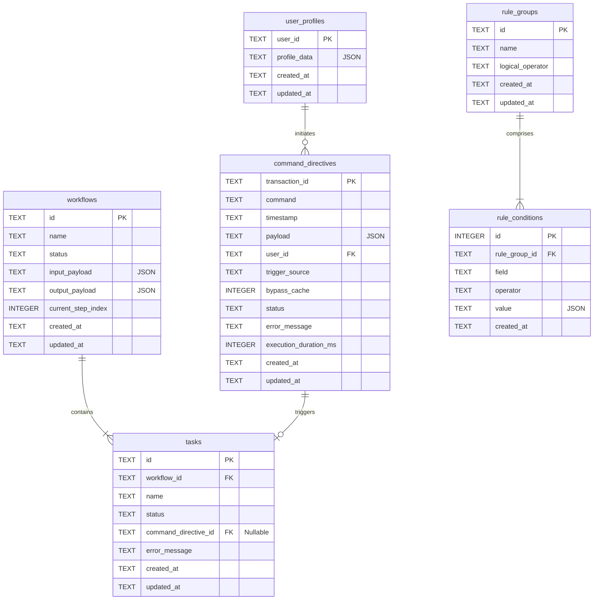

# Database Schema Spec

CommandOS utilizes **SQLite** for its local transactional persistence layer due to its serverless, zero-configuration nature, and absolute performance when colocated on a single node. High-frequency transient data (e.g., DOM scraping cache) is stored in Redis, while durable application state resides in SQLite.

## 1. Entity Relationship Overview



---

## 2. SQL DDL Specifications

```sql
-- Enforce Foreign Keys in SQLite at connection time:
-- PRAGMA foreign_keys = ON;

-- 1. USER PROFILES
CREATE TABLE IF NOT EXISTS user_profiles (
    user_id TEXT PRIMARY KEY,
    profile_data TEXT NOT NULL, -- JSON string mapping user preferences/profile structures
    created_at TEXT NOT NULL DEFAULT (strftime('%Y-%m-%dT%H:%M:%fZ', 'now')),
    updated_at TEXT NOT NULL DEFAULT (strftime('%Y-%m-%dT%H:%M:%fZ', 'now'))
);

-- 2. COMMAND DIRECTIVES (Audit Log & Queue Input)
CREATE TABLE IF NOT EXISTS command_directives (
    transaction_id TEXT PRIMARY KEY, -- UUIDv4
    command TEXT NOT NULL,           -- Namespaced: "career.sync-linkedin"
    timestamp TEXT NOT NULL,         -- Request timestamp (ISO 8601)
    payload TEXT NOT NULL,           -- JSON string containing payload arguments
    user_id TEXT NOT NULL,
    trigger_source TEXT NOT NULL CHECK (trigger_source IN ('CLI', 'DASHBOARD', 'CRON', 'WEBHOOK')),
    bypass_cache INTEGER NOT NULL CHECK (bypass_cache IN (0, 1)),
    status TEXT NOT NULL DEFAULT 'PENDING' CHECK (status IN ('PENDING', 'RUNNING', 'COMPLETED', 'FAILED')),
    error_message TEXT,
    execution_duration_ms INTEGER,
    created_at TEXT NOT NULL DEFAULT (strftime('%Y-%m-%dT%H:%M:%fZ', 'now')),
    updated_at TEXT NOT NULL DEFAULT (strftime('%Y-%m-%dT%H:%M:%fZ', 'now')),
    FOREIGN KEY (user_id) REFERENCES user_profiles(user_id) ON DELETE CASCADE
);

-- 3. WORKFLOWS (Orchestration Engine State)
CREATE TABLE IF NOT EXISTS workflows (
    id TEXT PRIMARY KEY,             -- UUIDv4
    name TEXT NOT NULL,              -- E.g., "job-application-pipeline"
    status TEXT NOT NULL CHECK (status IN ('PENDING', 'RUNNING', 'COMPLETED', 'FAILED', 'INTELLIGENCE_DEGRADED')),
    input_payload TEXT NOT NULL,     -- JSON string containing base input parameters
    output_payload TEXT,             -- JSON string containing aggregated results
    current_step_index INTEGER NOT NULL DEFAULT 0,
    created_at TEXT NOT NULL DEFAULT (strftime('%Y-%m-%dT%H:%M:%fZ', 'now')),
    updated_at TEXT NOT NULL DEFAULT (strftime('%Y-%m-%dT%H:%M:%fZ', 'now'))
);

-- 4. TASKS (Atomic Workflow Executions)
CREATE TABLE IF NOT EXISTS tasks (
    id TEXT PRIMARY KEY,             -- UUIDv4
    workflow_id TEXT NOT NULL,
    name TEXT NOT NULL,              -- Actionable descriptive name
    status TEXT NOT NULL CHECK (status IN ('PENDING', 'RUNNING', 'COMPLETED', 'FAILED', 'SKIPPED')),
    command_directive_id TEXT,       -- Optional command linked to this execution task
    error_message TEXT,
    created_at TEXT NOT NULL DEFAULT (strftime('%Y-%m-%dT%H:%M:%fZ', 'now')),
    updated_at TEXT NOT NULL DEFAULT (strftime('%Y-%m-%dT%H:%M:%fZ', 'now')),
    FOREIGN KEY (workflow_id) REFERENCES workflows(id) ON DELETE CASCADE,
    FOREIGN KEY (command_directive_id) REFERENCES command_directives(transaction_id) ON DELETE SET NULL
);

-- 5. RULE GROUPS (Rule Engine Configurations)
CREATE TABLE IF NOT EXISTS rule_groups (
    id TEXT PRIMARY KEY,             -- Unique config ID
    name TEXT NOT NULL,              -- E.g., "minimum-salary-filter"
    logical_operator TEXT NOT NULL CHECK (logical_operator IN ('AND', 'OR')),
    created_at TEXT NOT NULL DEFAULT (strftime('%Y-%m-%dT%H:%M:%fZ', 'now')),
    updated_at TEXT NOT NULL DEFAULT (strftime('%Y-%m-%dT%H:%M:%fZ', 'now'))
);

-- 6. RULE CONDITIONS (Nested Rule Group Filters)
CREATE TABLE IF NOT EXISTS rule_conditions (
    id INTEGER PRIMARY KEY AUTOINCREMENT,
    rule_group_id TEXT NOT NULL,
    field TEXT NOT NULL,             -- Dot-notation path: "job.salary.min"
    operator TEXT NOT NULL CHECK (operator IN (
        'GREATER_THAN_OR_EQUAL',
        'LESS_THAN_OR_EQUAL',
        'EQUALS',
        'NOT_EQUALS',
        'CONTAINS_ANY',
        'CONTAINS_ALL',
        'EXCLUDES'
    )),
    value TEXT NOT NULL,             -- JSON string (e.g. 100000, "TypeScript", ["Remote", "Hybrid"])
    created_at TEXT NOT NULL DEFAULT (strftime('%Y-%m-%dT%H:%M:%fZ', 'now')),
    FOREIGN KEY (rule_group_id) REFERENCES rule_groups(id) ON DELETE CASCADE
);
```

---

## 3. Database Indexes for High Performance

To ensure maximum performance during parallel queue executions and rapid control API lookups, the following index structures are implemented:

```sql
-- Speed up command searches by user and tracking status
CREATE INDEX IF NOT EXISTS idx_command_directives_user_status ON command_directives(user_id, status);
CREATE INDEX IF NOT EXISTS idx_command_directives_command ON command_directives(command);

-- Support rapid workflow updates and progress queries
CREATE INDEX IF NOT EXISTS idx_workflows_status ON workflows(status);
CREATE INDEX IF NOT EXISTS idx_tasks_workflow_id ON tasks(workflow_id);
CREATE INDEX IF NOT EXISTS idx_tasks_status ON tasks(status);

-- Accelerate condition evaluation queries when resolving rule groups
CREATE INDEX IF NOT EXISTS idx_rule_conditions_group ON rule_conditions(rule_group_id);
```

---

## 4. TypeScript to SQLite Serialization Policies

Since SQLite does not natively support array or rich object types, serialization policies are strictly enforced:

| TypeScript Type | SQLite Storage Class | Storage Format / Policy |
| --- | --- | --- |
| `boolean` | `INTEGER` | Stored as `0` (false) or `1` (true). |
| `Date` | `TEXT` | Stored as ISO 8601 string: `YYYY-MM-DDTHH:MM:SS.SSSZ`. UTC-normalized. |
| `object` | `TEXT` | Stored as serialized JSON string (`JSON.stringify()`). |
| `Array` | `TEXT` | Stored as serialized JSON array string. |
