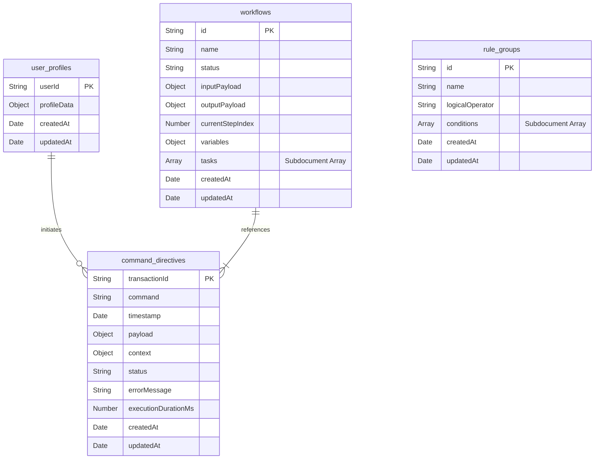

# Database Schema Spec

CommandOS utilizes **MongoDB** for its persistence layer. The platform relies on MongoDB's flexible, document-oriented structure to represent hierarchical execution logs, nested workflow tasks, dynamic user profile schemas, and JSON rules configurations.

---

## 1. Collections Overview & Entity Map



---

## 2. Collection Schema Specifications (Mongoose/TypeScript)

### 1. User Profiles Collection (`user_profiles`)
Stores dynamic candidate metrics, resumes, and integration credentials.

```typescript
import { Schema, model } from 'mongoose';

const UserProfileSchema = new Schema({
  userId: { type: String, required: true, unique: true },
  profileData: { type: Schema.Types.Map, of: Schema.Types.Mixed, required: true },
}, { timestamps: true });
```

### 2. Command Directives Collection (`command_directives`)
Acts as the central audit trail and queue dispatcher record.

```typescript
const CommandDirectiveSchema = new Schema({
  _id: { type: String, required: true }, // Map transactionId directly to _id
  command: { type: String, required: true, index: true },
  timestamp: { type: Date, required: true },
  payload: { type: Schema.Types.Map, of: Schema.Types.Mixed, required: true },
  context: {
    userId: { type: String, required: true, index: true },
    triggerSource: { type: String, enum: ['CLI', 'DASHBOARD', 'CRON', 'WEBHOOK'], required: true },
    bypassCache: { type: Boolean, default: false }
  },
  status: { type: String, enum: ['PENDING', 'RUNNING', 'COMPLETED', 'FAILED'], default: 'PENDING', index: true },
  errorMessage: { type: String },
  executionDurationMs: { type: Number }
}, { timestamps: true });
```

### 3. Workflows Collection (`workflows`)
Orchestrates sequential task executions, storing execution steps and variable contexts as subdocuments.

```typescript
const TaskSubSchema = new Schema({
  id: { type: String, required: true }, // UUIDv4
  name: { type: String, required: true },
  status: { type: String, enum: ['PENDING', 'RUNNING', 'COMPLETED', 'FAILED', 'SKIPPED'], default: 'PENDING' },
  commandDirectiveId: { type: String, ref: 'command_directives' },
  errorMessage: { type: String }
}, { timestamps: true });

const WorkflowSchema = new Schema({
  _id: { type: String, required: true }, // UUIDv4
  name: { type: String, required: true },
  status: { type: String, enum: ['PENDING', 'RUNNING', 'COMPLETED', 'FAILED', 'INTELLIGENCE_DEGRADED', 'PAUSED'], default: 'PENDING', index: true },
  inputPayload: { type: Schema.Types.Map, of: Schema.Types.Mixed, required: true },
  outputPayload: { type: Schema.Types.Map, of: Schema.Types.Mixed },
  currentStepIndex: { type: Number, default: 0 },
  variables: { type: Schema.Types.Map, of: Schema.Types.Mixed, default: {} }, // Accumulated context parameters
  tasks: [TaskSubSchema] // Nested array of task executions
}, { timestamps: true });
```

### 4. Rule Groups Collection (`rule_groups`)
Houses user-defined deterministic filters.

```typescript
const RuleConditionSubSchema = new Schema({
  field: { type: String, required: true }, // E.g., "job.salary.min"
  operator: { type: String, enum: [
    'GREATER_THAN_OR_EQUAL',
    'LESS_THAN_OR_EQUAL',
    'EQUALS',
    'NOT_EQUALS',
    'CONTAINS_ANY',
    'CONTAINS_ALL',
    'EXCLUDES'
  ], required: true },
  value: { type: Schema.Types.Mixed, required: true } // Can hold numbers, strings, or arrays
});

const RuleGroupSchema = new Schema({
  _id: { type: String, required: true }, // Config UUID or ID slug
  name: { type: String, required: true },
  logicalOperator: { type: String, enum: ['AND', 'OR'], required: true },
  conditions: [RuleConditionSubSchema]
}, { timestamps: true });
```

---

## 3. Database Indexes for High-Performance Queries

MongoDB indexes optimize searches during high-throughput workflow execution runs:

```javascript
// Compound index for commands lookup per user
db.command_directives.createIndex({ "context.userId": 1, "status": 1 });
db.command_directives.createIndex({ "command": 1 });

// Optimize workflows filtering based on execution states
db.workflows.createIndex({ "status": 1 });

// Speed up fetching nested tasks status
db.workflows.createIndex({ "tasks.id": 1 });
```
